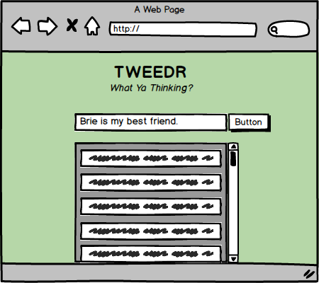

# GROUP HOMEWORK: Tweedr!!

## This homework is due 11PM ON MONDAY(5/23) NIGHT

## Outcomes on Wednesday

Let's make a cool new app called ***TWEEDR***!! Not Twitter, geez...

Your team will be responsible for making an express backend API that uses postsgres and a react frontend that consumes that API. Relax, you got this! 

### Wireframe

### Before you start

Let's start practicing project workflow best practices. One person on your team should set up a git repo. You should use the project tab to set up a project. It's only a few days but you should practice creating swim lanes, milestones etc. Your entire team should participate in the planning of the project, everyone is responsible for the following:

- Wireframe the mockup into the components you want to have
- Write out your user stories
- Make a project board with the code tasks from your user stories
- Agree on who will be responsible for which task and assign those tasks on your project board.

## Deliverables:

Your React/Express app should:
- Create an express API with a postgres backend that persists the tweeds.
    - You shouldn't need more than a single table in your database to accomplish this.
- Take an input of a Tweed
- Render all the Tweeds from the database into the browser
- Accomplish this with at least four components, possibly more:
    - `App`: holds calls to the database
    - `Input`: will take a text input and allow it to be submitted into the database
    - `TweedrFeed`: Holds `Tweed` components, which reflect the information in the database
    - `Tweed`: Holds one individual tweed
    - Any other components you see fit!
- A deployed express API and a deployed react app.

**A note on deployment** 
You will be deploying two separate apps. One will be an express API and one will be a react app. For the API you have to use heroku. For the react app feel free to use now or github pages. Use the [cors npm package](https://www.npmjs.com/package/cors) to deal with cross origin issues.

## Suggested workflow
- Start with the database. What will your table look like.
- You will each need a local copy of the database. In the end there will be single database on heroku but in the meantime you will each need a local copy to use in development.
- Create an API that uses your database. Test your routes with postman.
- Create a react app that uses axios to consume your api and displays the information. 

## Your homework submission should include:

- A **Single** issue ticket with all the names of your team members.
    - The issue ticket should have links to your deployed express API and your deployed react app.
- A readme with wireframes, userstories and a link to your github project board.

