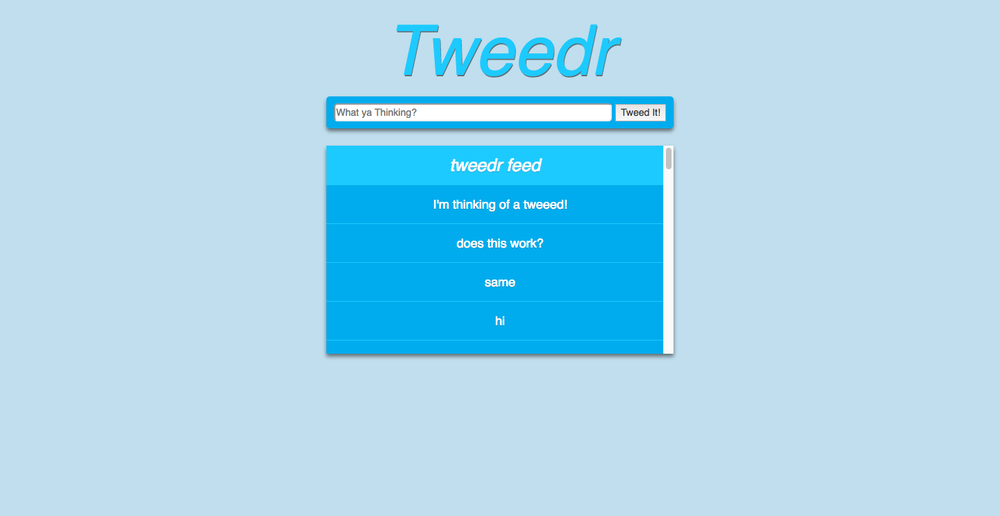

# Tweedr
> A browser-based blog that allows anyone to post what they are thinking to the world.

[![NPM Version][npm-image]][npm-url]
[![Build Status][travis-image]][travis-url]

	https://yamilburgos.github.io/Tweedr

Server: https://tweedrapp.herokuapp.com/

Projects: https://git.generalassemb.ly/GainorB/Tweedr/projects/1

### Wireframes

### User Stories
1. As a user, I like to see everyone's messages on the screen.
2. As a user, I like the ability to scroll through all of the tweeds

### Download Project & Install
1. Git clone or download this project
2. Open up Terminal or Command line
3. Navigate to the directory where the project was cloned or downloaded to
4. Run this command: psql -f ../db/schema.sql
5. This command will create a PostgreSQL database along with the tables
6. To run the application, you need to install the dependencies, run this command: npm install --save
7. To start the application, run this command: npm start
8. The application will run at: localhost:3000, if that port is already in use, run this command: PORT=1738 npm start
9. This command will start the server at: localhost:1738

## Meta
* [Eric](https://github.com/unit57)
* [Gainor](https://git.generalassemb.ly/GainorB)
* [Yamil](https://github.com/yamilburgos/) – yamil.burgos1293@gmail.com

## Contributing
1. Fork it (<https://github.com/yamilburgos/RedAndBlueSite/fork>)
2. Create your feature branch (`git checkout -b feature/fooBar`)
3. Commit your changes (`git commit -am 'Add some fooBar'`)
4. Push to the branch (`git push origin feature/fooBar`)
5. Create a new Pull Request

<!-- Markdown link & img dfn's -->
[npm-image]: https://img.shields.io/npm/v/datadog-metrics.svg?style=flat-square
[npm-url]: https://npmjs.org/package/datadog-metrics
[travis-image]: https://img.shields.io/travis/dbader/node-datadog-metrics/master.svg?style=flat-square
[travis-url]: https://travis-ci.org/dbader/node-datadog-metrics